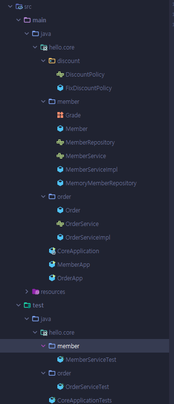

# 스프링 핵심 원리
---

> [김영한님 인프런](https://www.inflearn.com/course/%EC%8A%A4%ED%94%84%EB%A7%81-%ED%95%B5%EC%8B%AC-%EC%9B%90%EB%A6%AC-%EA%B8%B0%EB%B3%B8%ED%8E%B8)

# 스프링이란?
---

- **스프링 프레임워크**
    - 핵심 기술 : 스프링 DI 컨테이너, AOP 등
    - 웹 기술 : 스프링 MVC, 스프링 WebFlux
    - 데이터 접근 기술 : 트랜잭션, JDBC, ORM 지원, XML 지원
    - 기술 통합
    - 테스트
    - 언어
- **스프링 부트**
    - 스프링을 편리하게 사용할 수 있도록 지원, 최근에는 기본으로 사용
    - 단독으로 실행 가능한 스프링 애플리케이션을 쉽게 생성
    - 웹 서버를 내장해서 별도의 웹 서버 설치가 필요 없음
    - 손쉬운 빌드 구성을 위한 stater 종속성 제공
    - 3rd parth 라이브러리 자동 구성
    - 메트릭, 상태 확인, 외부 구성 같은 프로덕션 준비 기능 제공
    - 관례에 의한 간결한 설정
- 스프링 데이터
- 스프링 세션
- 스프링 시큐리티
- 스프링 Rest Docs
- 스프링 배치
- 스프링 클라우드

##  스프링의 핵심
---

- 객체 지향 언어가 가진 강력한 특징을 살려내는 프레임워크
- 좋은 객체 지향 애플리케이션을 개발할 수 있게 도와주는 프레임워크

# 좋은 객체 지향 프로그래밍이란?
---

- 추상화
- 캡슐화
- 상속
- 다형성

-> 객체 지향 프로그래밍은 프로그램을 유연하고 변경이 용이하게 만들기 때문에 대규모 소프트웨어 개발에 많이 사용

## 유연하고, 변경이 용이?
---

- 레고 블럭 조립하듯
- 컴포넌트를 쉽고 유연하게 변경하면서 개발할 수 있는 방법

-> 다형성

### 다형성(Polymorphism)
---

> 역할과 구현으로 구분하면 세상이 단순해지고, 유연해지며 변경도 편리해진다.

**장점**

- 클라이언트는 대상의 역할(인터페이스)만 알면 된다.
- 클라이언트는 구현 대상의 내부 구조를 몰라도 된다.
- 클라이언트는 구현 대상의 내부 구조가 변경 되어도 영향을 받지 않는다.
- 클라이언트는 구현 대상 자체를 변경해도 영향을 받지 않는다.

### 자바에서 다형성
---

- 역할 -> 인터페이스
- 구현 -> 인터페이스를 구현한 클래스, 구현 객체

> 다형성으로 인터페이스를 구현한 객체를 실행 시점에 유연하게 변경할 수 있다.

### 스프링과 객체 지향
---

- 다형성이 중요
- 스프링은 다형성을 극대화해서 이용할 수 있게 도와줌
- 제어의 역전(IoC), 의존관계 주입(DI)은 다형성을 활용해서 역할과 구현을 편리하게 다룰 수 있도록 지원

# 좋은 객체 지향 설계의 5가지 원칙 (SOLID)
---

- SRP : 단일 책임 원칙 (Single Responsiblility Principle)
    - 한 클래스는 하나의 책임만 가져야 한다.
    - **중요한 기준은 변경**
        - 변경이 있을 때 파급 효과가 적으면 단일 책임 원칙을 잘 따른 것
- OCP : 개방-폐쇄 원칙 (Open/Closed Principle)
    - 소프트웨어 요소는 확장에는 열려 있으나 변경에는 닫혀 있어야 한다.
    - 다형성
    - 인터페이스를 구현한 새로운 클래스를 하나 만들어서 새로운 기능을 구현
    - 역할과 구현의 분리
- LSP : 리스코프 치환 원칙 (Liskov Substitution Principle)
    - 프로그램의 객체는 프로그램의 정확성을 깨뜨리지 않으면서 하위 타입의 인스턴스로 바꿀 수 있어야 한다.
    - 다형성에서 하위 클래스는 인터페이스 규약을 다 지켜야 한다는 것
    - ex) 냉장고라는 인터페이스의 기능을 온도 뜨겁게로 구현하면 LSP 위반
- ISP : 인터페이스 분리 원칙 (Interface Segregation Principle)
    - 특정 클라이언트를 위한 인터페이스 여러 개가 범용 인터페이스 하나보다 낫다.
    - ex) 자동차 인터페이스 분리
        - 운전 인터페이스
        - 정비 인터페이스 분리
    - 인터페이스가 병확해지고, 대체 가능성이 높아진다.
- DIP : 의존관계 역전 원칙 (Dependency Inversion Principle)
    - 프로그래머는 "추상화에 의존해야지, 구체화에 의존하면 안된다."
    - 구현 클래스에 의존하지 말고, 인터페이스에 의존하라는 뜻
    - 역할(Role)에 의존하게 해야 한다는 것과 같다.

> 다형성만으로는 OCP, DIP 원칙을 지킬수 없음

# 객체 지향 설계와 스프링
---

- 스프링은 다음 기술로 다형성 + OCP, DIP를 가능하게 지원
    - DI(Dependency Injection) : 의존관계, 의존성 주입
    - DI 컨테이너 제공
- 클라이언트 코드의 변경 없이 기능 확장

# 스프링 핵심 원리 이해1 - 예제 만들기
---

## 비즈니스 요구사항과 설계
---

- 회원
    - 회원을 가입하고, 조회할 수 있다.
    - 회원은 일반과 VIP 두 가지 등급이 있다.
    - 회원 데이터는 자체 DB를 구축할 수 있고, 외부 시스템과 연동할 수 있다. (인터페이스 필요 할듯?)
- 주문과 할인 정책
    - 회원은 상품을 주문할 수 있다.
    - 회원 등급에 따라 할인 정책을 적용할 수 있다.
    - 할인 정책은 변경 가능성이 높다. 회사의 기본 할인 정책을 아직 정하지 못했고, 오픈 직전까지 고민을 미루고 싶다. 최악의 경우 할인을 적용하지 않을 수 도 있다.

-> 지금은 스프링 없이 순수한 자바로만 개발을 목표로 잡는다.



# 스프링 핵심 원리 이해2 - 객체 지향 원리 적용
---

## 새로운 할인 정책 개발
---

### 기존 코드의 문제점
---

> 할인 정책을 변경하려면 클라이언트인 `OrderServiceImpl`의 코드를 수정해야 한다. (개방-폐쇄 원칙 벗어남)

```java
public class OrderServiceImpl implements OrderService {

    private final MemberRepository memberRepository = new MemoryMemberRepository();
//    private final DiscountPolicy discountPolicy = new FixDiscountPolicy();
    private final DiscountPolicy discountPolicy = new RateDiscountPolicy();

}
```

- 우리는 역할과 구현을 충실하게 분리했다. -> O
- 다형성도 활용하고, 인터페이스와 구현 객체를 분리했다. -> O
- OCP, DIP 같은 객체지향 설계 원칙을 충실히 준수했다.
    - 그렇게 보이지만 아니다.
    - DIP : 추상 인터페이스와 구현 클래스 모두 의존하고 있다. -> 위반하고 있다.
    - OCP : DIP를 위반하기 때문에 FixDiscountPolicy에서 RateDiscountPolicy로 바뀌는 순간 OrderServiceImpl의 코드도 변경해야된다. -> 위반하고 있다.

### 문제점 해결 방법 - 1
---

```java
public class OrderServiceImpl implements OrderService {

    private final MemberRepository memberRepository = new MemoryMemberRepository();
//    private final DiscountPolicy discountPolicy = new FixDiscountPolicy();
//    private final DiscountPolicy discountPolicy = new RateDiscountPolicy();

    private DiscountPolicy discountPolicy;

}
```

> DIP는 지켰지만 구현 클래스가 없어서 동작하지 않음.

누군가 클라이언트인 `OrderServiceImpl`에 DiscountPolicy의 구현 객체를 대신 생성하고 주입해야 된다.

### 문제점 해결방법 - 2 (관심사의 분리)
---

AppConfig 클래스를 만들어 생성자를 통해 주입.

```java
package hello.core;

import hello.core.discount.FixDiscountPolicy;
import hello.core.member.MemberService;
import hello.core.member.MemberServiceImpl;
import hello.core.member.MemoryMemberRepository;
import hello.core.order.OrderService;
import hello.core.order.OrderServiceImpl;

public class AppConfig {

    public MemberService memberService() {
        return new MemberServiceImpl(new MemoryMemberRepository());
    }

    public OrderService orderService() {
        return new OrderServiceImpl(new MemoryMemberRepository(), new FixDiscountPolicy());
    }
}
```

- AppConfig는 애플리케이션의 실제 동작에 필요한 **구현 객체를 생성** 해준다.
- AppConfig는 생성한 객체 인스턴스의 참조(레퍼런스)를 **생성자를 통해서 주입** 해준다.

#### 리팩터링
---

```java
package hello.core;

import hello.core.discount.DiscountPolicy;
import hello.core.discount.FixDiscountPolicy;
import hello.core.member.MemberService;
import hello.core.member.MemberServiceImpl;
import hello.core.member.MemoryMemberRepository;
import hello.core.order.OrderService;
import hello.core.order.OrderServiceImpl;

public class AppConfig {

    public MemberService memberService() {
        return new MemberServiceImpl(memberRepository());
    }

    private MemoryMemberRepository memberRepository() {
        return new MemoryMemberRepository();
    }

    public OrderService orderService() {
        return new OrderServiceImpl(memberRepository(), discountPolicy());
    }
    
    public DiscountPolicy discountPolicy() {
        return new FixDiscountPolicy();
    }
}
```

- 중복으로 사용하는 부분을 변경
- 역할에 따른 구현이 잘보임

## 새로운 구조와 할인 정책 적용
---

```java
package hello.core;

import hello.core.discount.DiscountPolicy;
import hello.core.discount.FixDiscountPolicy;
import hello.core.discount.RateDiscountPolicy;
import hello.core.member.MemberService;
import hello.core.member.MemberServiceImpl;
import hello.core.member.MemoryMemberRepository;
import hello.core.order.OrderService;
import hello.core.order.OrderServiceImpl;

public class AppConfig {

    public MemberService memberService() {
        return new MemberServiceImpl(memberRepository());
    }

    private MemoryMemberRepository memberRepository() {
        return new MemoryMemberRepository();
    }

    public OrderService orderService() {
        return new OrderServiceImpl(memberRepository(), discountPolicy());
    }

    public DiscountPolicy discountPolicy() {
        return new RateDiscountPolicy();
    }
}
```

> AppConfig의 할인 정책만 변경해주면 된다.

## IoC, DI, 그리고 컨테이너
---

### 제어의 역전 IoC(Inversion of Control)
---

- 기존 프로그램은 클라이언트 구현 객체가 스스로 필요한 서버 구현 객체를 생성하고, 실행했다.
- AppConfig가 등장 이후에 구현 객체는 자신의 로직을 실행하는 역할만 담당, 프로그램의 제어 흐름은 이제 AppConfig가 가져간다.
- 프로그램에 대한 제어 흐름에 대한 권한은 모두 AppConfig가 가지고 있다. 심지어 OrderServiceImpl도 AppConfig가 생성한다. AppConfig는 OrderServiceImpl이 아닌 OrderService 인터페이스의 다른 구현 객체를 생성하고 실행할 수도 있다.
- 이렇듯 프로그램의 제어 흐름을 직접 제어하는 것이 아니라 외부에서 관리하는 것을 제어의 역전(IoC)이라 한다.

### 프레임워크 vs 라이브러리
---

- 프레임워크가 내가 작성한 코드를 제어하고, 대신 실행하면 프레임워크
- 내가 작성한 코드가 직접 제어의 흐름을 담당하면 그것은 프레임워크가 아니라 라이브러리다.

### 의존관계 주입 DI(Dependency Injection)
---
- OrderServiceImpl은 DiscountPolicy 인터페이스에 의존한다. 실제 어떤 구현 객체가 사용될지는 모른다.
- 의존관계는 **정적인 클래스 의존 관계와, 실행 시점에 결정되는 동적인 객체(인스턴스) 의존 관계** 둘을 분리해서 생각해야 한다.

## 스프링으로 전환하기
---

- ApplicationContext 스프링 컨테이너라 한다.
- 기존에는 개발자가 AppConfig를 사용해서 직접 객체를 생성하고 DI를 했지만 이제부터는 스프링 컨테이너를 통해서 사용
- 스프링 컨테이너는 @Configuration이 붙은 AppConfig를 설정(구성)정보를 사용한다. 여기서 @Bean 이라 적힌 메서드를 모두 호출해서 반환된 객체를 스프링 컨테이너에 등록한다. 이렇게 스프링 컨테이너에 등록된 객체를 스프링 빈이라 한다.
- 기존에는 개발자가 직접 필요한 객체를 AppConfig를 사용해서 조회 했지만 스프링 컨테이너를 통해서 필요한 스프링 빈을 찾아야 한다(appContext.getBean() 메서드를 사용해서 찾을 수 있다.)

```java
        ApplicationContext appContext = new AnnotationConfigApplicationContext(AppConfig.class);
        MemberService memberService = appContext.getBean("memberService", MemberService.class);
        OrderService orderService = appContext.getBean("orderService", OrderService.class);
```

# 스프링 컨테이너와 스프링 빈
---

## 스프링 컨테이너 생성
---

```java
        ApplicationContext appContext = new AnnotationConfigApplicationContext(AppConfig.class);
```

- ApplicationContext 스프링 컨테이너라 한다.
- ApplicationContext 인터페이스이다.
- 스프링 컨테이너는 XML 기반 or 애노테이션 기반의 자바 설정 클래스로 만들 수 있다.
- 직전에 AppConfig를 사용했던 방식이 애노테이션 기반의 자바 설정 클래스로 스프링 컨테이너를 만든것이다.

> 정확히는 스프링 컨테이너를 부를 때 BeanFactory와 ApplicationContext로 구분해서 이야기한다. BeanFactory를 직접 사용하는 경우는 거의 없으므로 일반적으로 ApplicationContext를 스프링 컨테이너라 한다.

## 컨테이너에 등록된 모든 빈 조회
---

```java
package hello.core.beanfind;

import hello.core.AppConfig;
import org.junit.jupiter.api.DisplayName;
import org.junit.jupiter.api.Test;
import org.springframework.beans.factory.config.BeanDefinition;
import org.springframework.context.annotation.AnnotationConfigApplicationContext;

public class ApplicationContextInfoTest {

    AnnotationConfigApplicationContext ac = new AnnotationConfigApplicationContext(AppConfig.class);

    @Test
    @DisplayName("모든 빈 출력하기")
    void findAllBean() {
        String[] beanDefinitionNames = ac.getBeanDefinitionNames();

        for (String beanDefinitionName : beanDefinitionNames) {
            Object bean = ac.getBean(beanDefinitionName);
            System.out.println("name = " + beanDefinitionName + " bean = " + bean);
        }
    }

    @Test
    @DisplayName("애플리케이션 빈 출력하기")
    void findApplicationBean() {
        String[] beanDefinitionNames = ac.getBeanDefinitionNames();

        for (String beanDefinitionName : beanDefinitionNames) {
            BeanDefinition beanDefinition = ac.getBeanDefinition(beanDefinitionName);

            if (beanDefinition.getRole() == BeanDefinition.ROLE_APPLICATION) {
                Object bean = ac.getBean(beanDefinitionName);
                System.out.println("name = " + beanDefinitionName + " bean = " + bean);
            }
        }
    }
}
```

- 모든 빈 출력하기
    - ac.getBeanDefinitionNames() 스프링에 등록된 모든 빈 이름을 조회
    - ac.getBean() 빈 이름으로 빈 객체(인스턴스)를 조회
- 애플리케이션 빈 출력하기
    - 스프링 내부에서 사용하는 빈 제외
    - getRole()을 통해 구분
        - ROLE_APPLICATION : 사용자가 정의한 빈
        - ROLE_INFRASTRUCTURE : 스프링 내부에서 사용하는 빈

## 스프링 빈 조회 - 기본
---

- ac.getBean(빈이름, 타입)
- ac.getBean(타입)
- 조회 대상 스프링 빈이 없으면 예외 발생
    - NoSuchBeanDefinitionException: No bean named 'xxx' available

### 테스트 코드
---

```java
package hello.core.beanfind;

import hello.core.AppConfig;
import hello.core.member.MemberService;
import hello.core.member.MemberServiceImpl;
import org.assertj.core.api.Assertions;
import org.junit.jupiter.api.DisplayName;
import org.junit.jupiter.api.Test;
import org.springframework.beans.factory.NoSuchBeanDefinitionException;
import org.springframework.context.annotation.AnnotationConfigApplicationContext;

import static org.assertj.core.api.Assertions.assertThat;
import static org.junit.jupiter.api.Assertions.assertThrows;

public class ApplicationContextBasicTest {

    AnnotationConfigApplicationContext ac = new AnnotationConfigApplicationContext(AppConfig.class);

    @Test
    @DisplayName("빈 이름으로 조회")
    void findBeanByName() {
        MemberService memberService = ac.getBean("memberService", MemberService.class);
        assertThat(memberService).isInstanceOf(MemberServiceImpl.class);
    }

    @Test
    @DisplayName("이름 없이 타입으로만 조회")
    void findBeanByType() {
        MemberService memberService = ac.getBean(MemberService.class);
        assertThat(memberService).isInstanceOf(MemberServiceImpl.class);
    }

    // 역할에 의존해야하는데 구현에 의존한 코드
    @Test
    @DisplayName("구체 타입으로 조회")
    void findBeanByName2() {
        MemberService memberService = ac.getBean("memberService", MemberServiceImpl.class);
        assertThat(memberService).isInstanceOf(MemberServiceImpl.class);
    }

    @Test
    @DisplayName("빈 이름으로 조회 X")
    void findBeanByNameX() {
//        MemberService xxxx = ac.getBean("xxxx", MemberService.class);
        assertThrows(NoSuchBeanDefinitionException.class,
                () -> ac.getBean("xxxx", MemberService.class));
    }
}
```

## 스프링 빈 조회 - 동일한 타입이 둘 이상
---

### 테스트 코드 - 이름을 지정해준다
---

```java
package hello.core.beanfind;

import hello.core.AppConfig;
import hello.core.member.MemberRepository;
import hello.core.member.MemoryMemberRepository;
import org.assertj.core.api.Assertions;
import org.junit.jupiter.api.DisplayName;
import org.junit.jupiter.api.Test;
import org.springframework.beans.factory.NoUniqueBeanDefinitionException;
import org.springframework.context.annotation.AnnotationConfigApplicationContext;
import org.springframework.context.annotation.Bean;
import org.springframework.context.annotation.Configuration;

import java.util.Map;

import static org.junit.jupiter.api.Assertions.assertThrows;

public class ApplicationContextSameBeanFindTest {

    AnnotationConfigApplicationContext ac = new AnnotationConfigApplicationContext(SameBeanConfig.class);

    @Test
    @DisplayName("타입으로 조회시 같은 타입이 둘 이상 있으면, 중복 오류가 발생한다")
    void findBeanByTypeDuplicate() {
        assertThrows(NoUniqueBeanDefinitionException.class,
                () -> ac.getBean(MemberRepository.class));
    }

    @Test
    @DisplayName("타입으로 조회시 같은 타입이 둘 이상 있으면, 이름으로 지정하면된다.")
    void findBeanByName() {
        MemberRepository bean = ac.getBean("memberRepository1", MemberRepository.class);
        Assertions.assertThat(bean).isInstanceOf(MemberRepository.class);
    }

    @Test
    @DisplayName("특정 타입을 모두 조회하기")
    void findAllBeanByType() {
        Map<String, MemberRepository> beansOfType = ac.getBeansOfType(MemberRepository.class);
        for (String key : beansOfType.keySet()) {
            System.out.println("key = " + key + " value = " + beansOfType.get(key));
        }

        System.out.println("beansOfType = " + beansOfType);
        Assertions.assertThat(beansOfType.size()).isEqualTo(2);
    }

    @Configuration
    static class SameBeanConfig {

        @Bean
        public MemberRepository memberRepository1() {
            return new MemoryMemberRepository();
        }

        @Bean
        public MemberRepository memberRepository2() {
            return new MemoryMemberRepository();
        }
    }
}
```

## 스프링 빈 조회 - 상속관계
---

- 부모 타입으로 조회하면, 자식 타입도 함께 조회한다.
- 그래서 모든 자바 객체의 최고 부모인 `Object` 타입으로 조회하면, 모든 스프링 빈을 조회한다.

## BeanFactory와 ApplicationContext
---

> beanFactory와 ApplicationContext에 대해서 알아보자

- BeanFactory
    - 스프링 컨테이너의 최상위 인터페이스
    - 스프링 빈을 관리하고 조회하는 역할을 담당
    - 대표적으로 getBean() 제공
- ApplicationContext
    - BeanFactory 기능을 모두 상속받아서 제공한다.
    - 빈을 관리하고 검색하는 기능을 BeanFactory가 제공해주는데, 그러면 둘의 차이가 뭘까?
    - 애플리케이션을 개발할 때는 빈은 관리하고 조회하는 기능은 물론이고, 수 많은 부가기능이 필요하다.

**정리**

- ApplicationContext는 BeanFactory의 기능을 상속
- ApplicationContext는 빈 관리기능 + 편리한 부가 기능을 제공
- BeanFactory를 직접 사용할 일은 거의 없다. 부가기능이 포함된 ApplicationContext를 사용한다.
- BeanFactory나 ApplicationContext를 스프링 컨테이너라 한다.

## 스프링 빈 설정 메타 정보 - BeanDefinition
---

- 스프링이 다양한 설정 형식을 지원 가능하게 해주는 중심에 `BeanDefinition` 이라는 추상화가 있다.
- 역할과 구현을 개념적으로 나눈 것
    - XML을 읽어서 BeanDefinition을 만든다.
    - 자바 코드를 읽어서 BeanDefinition을 만든다.
    - 스프링 컨테이너는 자바 코드인지, XML인지 몰라도 된다.
- BeanDefinition을 빈 설정 메타정보라 한다.
    - @Bean, <bean> 당 각각 하나씩 메타 정보가 생성된다.
- 스프링 컨테이너는 이 메타정보를 기반으로 스프링 빈을 생성한다.

### BeanDefinition 정보
---

- BeanClassName : 생성할 빈의 클래스 명(자바 설정 처럼 팩토리 역할의 빈을 사용하면 없음)
- factoryBeanName : 팩토리 역할의 빈을 사용할 경우 이름
- factoryMethodName : 빈을 생성할 팩토리 메서드 지정
- Scope : 싱글톤(기본값)
- lazyInit : 스프링 컨테이너를 생성할 때 빈을 생성하는 것이 아니라 실제 빈을 사용할 때 까지 최대한 생성을 지연처리 하는지 여부
- InitMethodName : 빈을 생성하고, 의존관계를 적용한 뒤에 호출되는 초기화 메서드 명
- DestoryMethodName : 빈의 생명주기가 끝나서 제거하기 직전에 호출되는 메서드 명
- Constructor arguments, Properties : 의존관계 주입에서 사용한다. (자바 설정 처럼 팩토리 역할의 빈을 사용하면 없음)

```java
package hello.core.beandefinition;

import hello.core.AppConfig;
import org.junit.jupiter.api.DisplayName;
import org.junit.jupiter.api.Test;
import org.springframework.beans.factory.config.BeanDefinition;
import org.springframework.context.annotation.AnnotationConfigApplicationContext;

import java.lang.annotation.Annotation;

public class BeanDefinitionTest {

    AnnotationConfigApplicationContext ac = new AnnotationConfigApplicationContext(AppConfig .class);

    @Test
    @DisplayName("빈 설정 메타정보 확인")
    void findApplicationBean() {
        String[] beanDefinitionNames = ac.getBeanDefinitionNames();

        for (String beanDefinitionName : beanDefinitionNames) {

            BeanDefinition beanDefinition = ac.getBeanDefinition(beanDefinitionName);

            if (beanDefinition.getRole() == BeanDefinition.ROLE_APPLICATION) {
                System.out.println("beanDefinitionName = " + beanDefinitionName +
                        " beanDefinition = " + beanDefinition);
            }
        }
    }
}
```

## 웹 애플리케이션과 싱글톤
---

- 스프링은 태생이 기업용 온라인 서비스 기술을 지원하기 위해 탄생
- 대부분의 스프링 애플리케이션은 웹 애플리케이션이다. 물론 웹이 아닌 애플리케이션 개발도 얼마든지 개발할 수 있다.
- 웹 애플리케이션은 보통 여러 고객이 동시에 요청

### 스프링 없이 순수한 DI 컨테이너
---

```java
package hello.core.singleton;

import hello.core.AppConfig;
import hello.core.member.MemberService;
import org.assertj.core.api.Assertions;
import org.junit.jupiter.api.DisplayName;
import org.junit.jupiter.api.Test;

public class SingletonTest {

    @Test
    @DisplayName("스프링 없는 순수한 DI 컨테이너")
    void pureContainer() {
        AppConfig appconfig = new AppConfig();
        // 1. 조회 : 호출할 때 마다 객체를 생성
        MemberService memberService1 = appconfig.memberService();

        // 2. 조회 : 호출할 때 마다 객체를 생성
        MemberService memberService2 = appconfig.memberService();

        // 참조값이 다른 것을 확인
        System.out.println("memberService1 = " + memberService1);
        System.out.println("memberService2 = " + memberService2);

        Assertions.assertThat(memberService1).isNotSameAs(memberService2);
    }
}
```

- 우리가 만들었던 스프링 없는 순수한 DI 컨테이너인 AppConfig는 요청할 때 마다 객체를 새로 생성
- 고객 트래픽이 초당 100이 나오면 초당 100개 객체가 생성되고 소멸 -> 메모리 낭비
- 해결 방안은 해당 객체가 딱 1개만 생성되고, 공유하도록 설계 -> 싱글톤 패턴

### 싱글톤 패턴
---

- 클래스의 인스턴스가 딱 1개만 생성되는 것을 보장하는 디자인 패턴
- 객체 인스턴스를 2개 이상 생성하지 못하도록 막아야 한다.
    - private 생성자를 사용해서 외부에서 임의로 new 키워드를 사용하지 못하도록 막아야한다.

```java
package hello.core.singleton;

public class SingletonService {

    // static 영역에 객체를 딱 1개망 생성
    private static final SingletonService instance = new SingletonService();

    // public으로 열어서 객체 인스턴스가 필요하면 static 메서드를 통해서만 조회 가능
    public static SingletonService getInstance() {
        return instance;
    }

    // 생성자를 private로 선언해서 외부에서 new 키워드를 사용한 객체 생성을 못하게 막는다.
    private SingletonService() {
    }

    public void logic() {
        System.out.println("싱글톤 객체 로직 호출");
    }
}
```

**테스트코드**
```java
    @Test
    @DisplayName("싱글톤 패턴을 적용한 객체 사용")
    void singletonServiceTest() {
        SingletonService service = SingletonService.getInstance();
        SingletonService service2 = SingletonService.getInstance();

        System.out.println("service = " + service);
        System.out.println("service2 = " + service2);

        Assertions.assertThat(service).isSameAs(service2);
    }
```

#### 싱글톤 패턴의 단점
---

- 싱글톤 패턴을 구현하는 코드 자체가 많이 들어간다.
- 의존관계상 클라이언특가 구체 클래스에 의존한다 - DIP 위반
- 클라이언트가 구체 클래스에 의존해서 OCP 원칙을 위반한 가능성이 높다.
- 테스트하기 어렵다.
- 내부 속성을 변경하거나 초기화 하기 어렵다.
- private 생성자로 자식 클래스를 만들기 어렵다.
- 결론적으로 유연성이 떨어진다.
- 안티패턴으로 불리기도 한다.

## 싱글톤 컨테이너
---

> 스프링 컨테이너는 싱글톤 패턴의 문제점을 해결하면서, 객체 인스턴스를 싱글톤(1개만 생성)으로 관리, 지금까지 우리가 학습한 스프링 빈이 바로 싱글톤으로 관리되는 빈

**싱글톤 컨테이너**

- 스프링 컨테이너는 싱글톤 패턴을 적용하지 않아도, 객체 인스턴스를 싱글톤으로 관리
    - 이전에 설명한 컨테이너 생성 과정을 자세히 보자. 컨테이너는 객체를 하나만 생성해서 관리
- 스프링 컨테이너는 싱글톤 컨테이너 역할을 한다. 이렇게 싱글톤 객체를 생성하고 관리하는 기능을 싱글톤 레지스트리라 한다.
- 스프링 컨테이너의 이런 기능 덕분에 싱글톤 패턴의 모든 단점을 해결하면서 객체를 싱글톤으로 유지할 수 있다.
    - 싱글톤 패턴을 위한 지저분한 코드가 들어가지 않아도 된다.
    - dip, ocp, 테스트, PRIVATE 생성자로부터 자유롭게 싱글톤 패턴을 사용 가능

```java
    @Test
    @DisplayName("스프링 컨테이너와 싱글톤")
    void springContainer() {
        ApplicationContext ac = new AnnotationConfigApplicationContext(AppConfig.class);
        // 1. 조회 : 호출할 때 마다 객체를 생성
        MemberService memberService1 = ac.getBean("memberService", MemberService.class);

        // 2. 조회 : 호출할 때 마다 객체를 생성
        MemberService memberService2 = ac.getBean("memberService", MemberService.class);

        // 참조값이 다른 것을 확인
        System.out.println("memberService1 = " + memberService1);
        System.out.println("memberService2 = " + memberService2);

        Assertions.assertThat(memberService1).isSameAs(memberService2);
    }
```

## 싱글톤 방식의 주의점
---

- 싱글톤 패턴, 스프링과 같은 싱글톤 컨테이너를 사용, 객체 인스턴스를 하나만 생성해서 공유하는 싱글톤 방식은 여러 클라이언트가 하나의 같은 객체 인스턴스를 공유하기 때문에 싱글톤 객체는 상태를 유지(stateful)하게 설계하면 안된다.
- 무상태(stateless)로 설계해야 한다.
    - 특정 클라이언트에 의존적인 필드가 있으면 안된다.
    - 특정 클라이언트가 값을 변경할 수 있는 필드가 있으면 안된다.
    - 가급적 읽기만 가능해야 한다.
    - 필드 대신에 자바에서 공유되지 않는, 지역변수, 파라미터, ThreadLocal 등을 사용해야 한다.
- 스프링 빈의 필드에 공유 값을 설정하면 정말 큰 장애가 발생할 수 있다.

### 문제의 코드
---

```java
public class StatefulService {

    private int price; // 상태를 유지하는 필드

    public void order(String name, int price) {
        System.out.println("name = " + name + " price = " + price);
        this.price = price; // 여기가 문제
    }

    public int getPrice() {
        return price;
    }
}
```

```java
import org.assertj.core.api.Assertions;
import org.junit.jupiter.api.Test;
import org.springframework.context.ApplicationContext;
import org.springframework.context.annotation.AnnotationConfigApplicationContext;
import org.springframework.context.annotation.Bean;

import static org.junit.jupiter.api.Assertions.*;

class StatefulServiceTest {

    @Test
    void statefulServiceSingleton() {
        ApplicationContext ac = new AnnotationConfigApplicationContext(TestConfig.class);
        StatefulService statefulService1 = ac.getBean(StatefulService.class);
        StatefulService statefulService2 = ac.getBean(StatefulService.class);

        // ThreadA : A사용자가 10000 주문
        statefulService1.order("userA", 10000);

        // ThreadA : B사용자가 20000 주문
        statefulService2.order("userB", 20000);

        // ThreadA: 사용자A 주문 금액 조회
        int price = statefulService1.getPrice();

        Assertions.assertThat(price).isEqualTo(10000);
    }

    static class TestConfig {

        @Bean
        public StatefulService statefulService() {
            return new StatefulService();
        }
    }
}
```

### 해결
---

```java
public class StatefulService {

    //private int price; // 상태를 유지하는 필드

    public int order(String name, int price) {
        System.out.println("name = " + name + " price = " + price);
        //this.price = price; // 여기가 문제
        return price;
    }

//    public int getPrice() {
//        return price;
//    }
}
```

```java
import org.assertj.core.api.Assertions;
import org.junit.jupiter.api.Test;
import org.springframework.context.ApplicationContext;
import org.springframework.context.annotation.AnnotationConfigApplicationContext;
import org.springframework.context.annotation.Bean;

import static org.junit.jupiter.api.Assertions.*;

class StatefulServiceTest {

    @Test
    void statefulServiceSingleton() {
        ApplicationContext ac = new AnnotationConfigApplicationContext(TestConfig.class);
        StatefulService statefulService1 = ac.getBean(StatefulService.class);
        StatefulService statefulService2 = ac.getBean(StatefulService.class);

        // ThreadA : A사용자가 10000 주문
        int userAPrice = statefulService1.order("userA", 10000);

        // ThreadA : B사용자가 20000 주문
        int userBPrice = statefulService1.order("userB", 20000);

        // ThreadA: 사용자A 주문 금액 조회
//        int price = statefulService1.getPrice();

        Assertions.assertThat(userAPrice).isEqualTo(10000);
    }

    static class TestConfig {

        @Bean
        public StatefulService statefulService() {
            return new StatefulService();
        }
    }
}
```

## 컴포넌트 스캔
---

### 컴포넌트 스캔과 의존관계 자동 주입 시작하기
---

- 지금까지 스프링 빈을 등록할 때 설정 정보에 직접 등록할 스프링 빈을 나열
- 등록할 스프링 빈이 수십, 수백개가 되면 일일이 등록하기 귀찮곡, 설정 정보도 커지고 누락하는 문제가 발생
- 스프링은 설정 정보가 없어도 자동으로 스프링 빈을 등록하는 컴포넌트 스캔 기능 제공
- 의존ㄱ관계도 자동으로 주입하는 @Autowired 라는 기능도 제공

```java
package hello.core;

import org.springframework.context.annotation.ComponentScan;
import org.springframework.context.annotation.Configuration;
import org.springframework.context.annotation.FilterType;

@Configuration
@ComponentScan(
        excludeFilters = @ComponentScan.Filter(type = FilterType.ANNOTATION, classes = Configuration.class) // Configuration도 @Component 애노테이션이 붙어있기 때문에 제외 시켜야 한다.
) // 자동으로 컴포넌트 애노테이션이 붙은 클래스를 찾아서 자동으로 스프링 빈으로 등록
public class AutoAppConfig {
}
```

> 보통 실무에서는 Configuration을 제외시키지는 않지만 기존 예외 코드를 유지하기 위해서 제외시킴

#### Annotation
---

- @Component : 스프링 컨테이너에서 컴포넌트 스캔시 자동으로 빈 등록
- @Autowired : 객체 생성 시점 스프링 컨테이너에서 해당 스프링빈을 찾아서 주입

### 탐색 위치와 기본 스캔 대상
---

```java
package hello.core;

import org.springframework.context.annotation.ComponentScan;
import org.springframework.context.annotation.Configuration;
import org.springframework.context.annotation.FilterType;

@Configuration
@ComponentScan(
        basePackages = "hello.core.member", // 특정 대상만 컴포넌트 스캔이 대상이 되도록 지정
        excludeFilters = @ComponentScan.Filter(type = FilterType.ANNOTATION, classes = Configuration.class) // Configuration도 @Component 애노테이션이 붙어있기 때문에 제외 시켜야 한다.
) // 자동으로 컴포넌트 애노테이션이 붙은 클래스를 찾아서 자동으로 스프링 빈으로 등록
public class AutoAppConfig {
}
```

- basePackages : 탐색할 패키지의 시작 위치를 지정, 하위 패키지를 모두 탐색
    - 여러 시작 위치 지정 가능
- basePackageClasses : 지정한 클래스의 패키지를 탐색 시작 위치로 지정
- 디폴트는 @ComponentScan 애노테이션이 붙은 설정 정보 클래스의 패키지가 시작 위치가 된다.